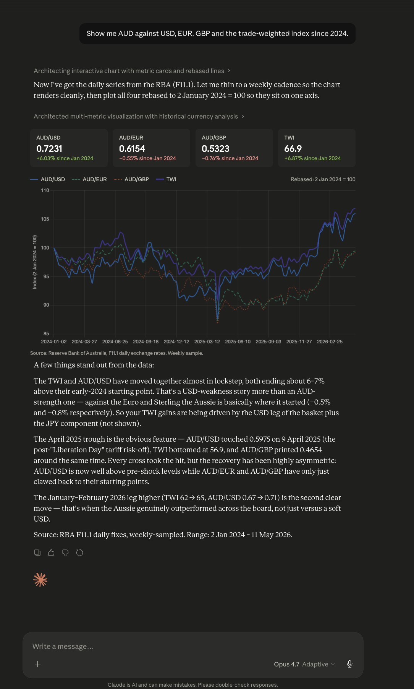
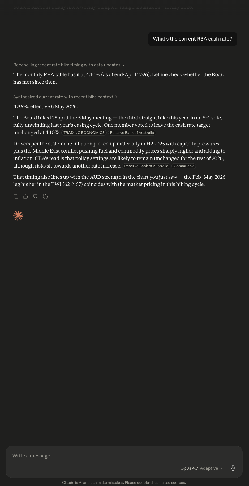

# rba-mcp

[](https://pypi.org/project/rba-mcp/)
[](https://pypi.org/project/rba-mcp/)
[](https://github.com/Bigred97/rba-mcp/blob/main/LICENSE)
[](https://github.com/Bigred97/rba-mcp/actions/workflows/test.yml)
[](https://github.com/Bigred97/rba-mcp/actions/workflows/codeql.yml)
[](https://glama.ai/mcp/servers/Bigred97/rba-mcp)

**Ask Claude about Australian interest rates, exchange rates, and lending rates and get real, current numbers** — not "I don't have access to that data." This MCP server gives Claude (and other MCP clients like Cursor) live access to the [Reserve Bank of Australia's statistical tables](https://www.rba.gov.au/statistics/tables/), with curated mappings for the most-asked indicators.



Companion to [abs-mcp](https://github.com/Bigred97/abs-mcp) (ABS macro stats), [ato-mcp](https://github.com/Bigred97/ato-mcp) (ATO tax + ACNC charity data), and [au-weather-mcp](https://github.com/Bigred97/au-weather-mcp) (Australian weather via Open-Meteo + BOM) — together the four cover the most-asked Australian official data.

## What you can ask

Once installed, your LLM can answer questions like:

| Question | Real response (verified) |
|---|---|
| What's the current RBA cash rate? | **4.10%** (Apr 2026) |
| What's the 3-month bank bill yield? | **4.34%** (Apr 2026) |
| AUD/USD today? | **0.7231** (11 May 2026) |
| Trade-weighted index? | **66.9** (11 May 2026) |
| Average mortgage rate (owner-occupier variable)? | **6.00%** (Mar 2026) |
| 12-month term deposit rate? | **5.00%** (Apr 2026) |
| Show me AUD vs USD/EUR/GBP since 2024 | Daily series, all three currencies, one call |
| TWI trend since 1983? | Monthly observations going back 40+ years |

Every answer comes with the period, units (Per cent per annum, USD per AUD, etc.), the publication date, and a link back to the RBA source. The MCP wraps RBA's CSV statistical tables and exposes them through 5 plain-English tools.

## Install

```bash
# After publish:
uvx --upgrade rba-mcp

# Local dev:
uv pip install -e .
```

### Claude Desktop

Add to `~/Library/Application Support/Claude/claude_desktop_config.json`:

```json
{
  "mcpServers": {
    "rba": {
      "command": "uvx",
      "args": ["--upgrade", "rba-mcp"]
    }
  }
}
```

> **Why `--upgrade`?** `uvx rba-mcp` (without the flag) uses whatever wheel is cached and never adopts new PyPI releases on its own — Claude Desktop's MCP child process keeps running the same wheel until you fully quit the app and refresh the cache by hand. `--upgrade` makes uvx check PyPI on each launch and pull a newer release if one exists. Recommended for everyone except offline-first / pinned-version workflows. To verify which version is currently serving you, look at the `server_version` field on any `DataResponse` (added in 0.1.5).

If you also have `abs-mcp` installed, both servers run side-by-side. Claude disambiguates with the server prefix (`rba:get_data` vs `abs:get_data`).

For local dev (pre-PyPI):

```json
{
  "mcpServers": {
    "rba": {
      "command": "uv",
      "args": ["run", "--directory", "/absolute/path/to/rba-mcp", "rba-mcp"]
    }
  }
}
```

### Cursor

Add to `~/.cursor/mcp.json` (or workspace `.cursor/mcp.json`):

```json
{
  "mcpServers": {
    "rba": {
      "command": "uvx",
      "args": ["--upgrade", "rba-mcp"]
    }
  }
}
```

## Tools

| Tool | What it does |
|---|---|
| `search_tables(query, limit=10)` | Fuzzy-search RBA F-tables by name or topic. |
| `describe_table(table_id)` | Plain-English series listing for one F-table. |
| `get_data(table_id, series, start_date, end_date, format)` | Query data. `series=None` returns all curated series; format = records / series / csv. |
| `latest(table_id, series)` | Most-recent observation for the requested series. |
| `list_curated()` | The 5 F-table IDs with hand-curated plain-English support. |

## Curated F-tables

For these five, `series` accepts plain-English keys (e.g. `"aud_usd"` instead of `"FXRUSD"`):

- **F1.1** — Money Market — Monthly: cash rate target, cash rate, bank bills, OIS rates, treasury notes
- **F4** — Retail Deposit & Investment Rates: transaction accounts, savings, term deposits, cash management trusts
- **F6** — Housing Lending Rates: owner-occupier vs investor, variable vs fixed, outstanding vs new loans
- **F11** — Exchange Rates — Monthly History (1983+): AUD/USD, AUD/EUR, AUD/GBP, AUD/JPY, AUD/CNY, AUD/NZD, TWI
- **F11.1** — Exchange Rates — Daily (2023+): same series, daily resolution

Any other F-table works too — pass raw RBA series IDs (e.g. `"FXRUSD"`) instead of curated keys.

## Worked examples

**"What's the current RBA cash rate?"**

```
latest(table_id="F1.1", series="cash_rate_target")
```

**"AUD to USD over the last year"**

```
get_data(table_id="F11.1", series="aud_usd", start_date="2024")
```

**"Compare AUD against USD, EUR and GBP since 2020"**

```
get_data(
  table_id="F11",
  series=["aud_usd", "aud_eur", "aud_gbp"],
  start_date="2020"
)
```

## Period formats

RBA series use ISO-style date formats. Pass `start_date` / `end_date` as:

| Format | Example | Use for |
|---|---|---|
| `YYYY` | `"2024"` *or* `2024` | Calendar year (int year also accepted, 0.1.8+) |
| `YYYY-MM` | `"2024-03"` | Calendar month (`end_date="2024-12"` includes all of December — fixed in 0.1.4) |
| `YYYY-MM-DD` | `"2024-03-15"` | Specific day (daily tables only) |

`start_date` snaps to the first instant of its period; `end_date` snaps to the last. So `start="2024", end="2024"` returns "all of 2024", not just 1 January.

## Verifying your install

The running MCP server reports its version on every `DataResponse`:

```json
{ ..., "server_version": "0.1.8", ... }
```

If you see a value below the [latest on PyPI](https://pypi.org/project/rba-mcp/), your `uvx` cache is stale. Either switch to `["--upgrade", "rba-mcp"]` in your config (recommended), or refresh manually:

```bash
uvx --refresh rba-mcp --help
# Then fully quit and relaunch Claude Desktop (Cmd+Q — window-close is not enough).
```

Claude Desktop's MCP child processes are long-lived; refreshing the wheel cache does **not** restart an already-running server. Cold app launch is required.

## Development

```bash
git clone https://github.com/Bigred97/rba-mcp.git
cd rba-mcp
uv sync --extra dev
uv pip install -e .

# Unit tests (no network)
uv run pytest

# Live integration tests (hits RBA CDN)
uv run pytest -m live
```

The SQLite cache lives at `~/.rba-mcp/cache.db`. Data refreshes every 6h, latest 15min. Delete to force a refresh.

## How it works

Claude picks the right tool, fills in the curated series keys, calls the live RBA CDN, and synthesises the answer. When the curated table is stale relative to a rate decision (RBA's monthly F1.1 publishes around the 5th business day, but Board meetings can hike between publications), Claude fluidly composes web-search results with this server's data:



You don't have to know what `FIRMMCRT` or `FXRUSD` mean — and neither does Claude. The server's curated YAMLs map plain-English keys (`cash_rate_target`, `aud_usd`) to RBA series IDs and surface unit attribution + the CC-BY 4.0 attribution string in every response.

## Sister MCPs (Australian Public Data portfolio)

The portfolio runs side-by-side in any MCP client; Claude disambiguates via the server prefix (`rba:latest` vs `abs:latest` vs `ato:get_data` vs `weather:latest`).

- [abs-mcp](https://pypi.org/project/abs-mcp/) — Australian Bureau of Statistics (CPI, unemployment, ERP, building approvals)
- **rba-mcp** — this one. Reserve Bank of Australia (cash rate, lending stats, exchange rates).
- [ato-mcp](https://pypi.org/project/ato-mcp/) — Australian Taxation Office (tax stats, ACNC charities)
- [apra-mcp](https://pypi.org/project/apra-mcp/) — Australian Prudential Regulation Authority (banking, insurance, super)
- [aihw-mcp](https://pypi.org/project/aihw-mcp/) — Australian Institute of Health and Welfare
- [asic-mcp](https://pypi.org/project/asic-mcp/) — Australian Securities and Investments Commission (company registers)
- [aemo-mcp](https://pypi.org/project/aemo-mcp/) — Australian Energy Market Operator (NEM dispatch, spot prices, generation)
- [au-weather-mcp](https://pypi.org/project/au-weather-mcp/) — Open-Meteo (Bureau of Meteorology aggregator)
- [wgea-mcp](https://pypi.org/project/wgea-mcp/) — Workplace Gender Equality Agency
- [aus-identity](https://pypi.org/project/aus-identity/) — Postcode / state / ABN normalisation helper used by all sisters

See [examples/claude_desktop_config_both.json](examples/claude_desktop_config_both.json) for an example multi-server config.

## Data attribution

RBA data is licensed under [Creative Commons Attribution 4.0 International (CC BY 4.0)](https://www.rba.gov.au/copyright/). Every `DataResponse` from this server includes an `attribution` field with the required notice. If you redistribute responses, credit the RBA.

## Changelog

See [CHANGELOG.md](CHANGELOG.md) for release history.

## License

MIT — Harry Vass, 2026.
